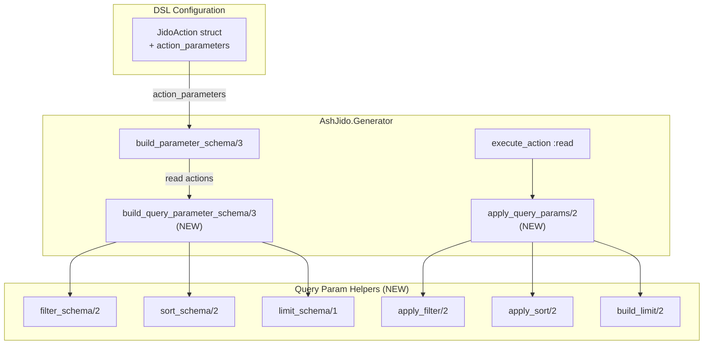
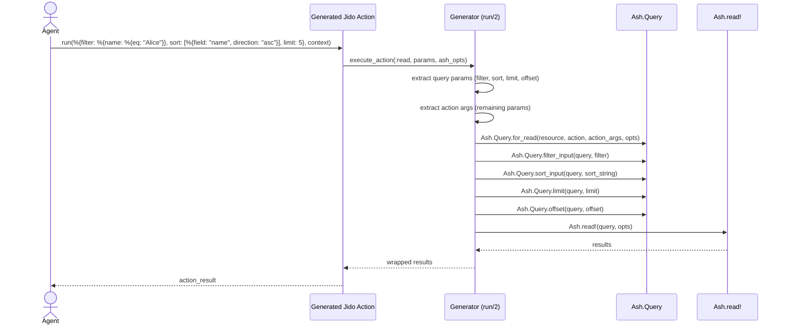

# Query Parameters for Read Actions — Implementation Plan

**Metadata:**

- Type: plan
- Status: completed
- Created: 2026-03-18
- Topic: query-parameters
- Issue: [agentjido/ash_jido#4](https://github.com/agentjido/ash_jido/issues/4)

## Executive Summary

- **Feature**: Expose Ash query parameters (filter, sort, limit, offset) in
  generated Jido tool schemas for read actions, enabling agents to search, sort,
  and paginate results
- **Complexity**: Medium
- **Approach**: Adapt ash_ai's proven schema generation and runtime execution
  patterns to ash_jido's NimbleOptions-based schema system
- **Key integration points**: `AshJido.Generator` (schema building + runtime
  execution), `AshJido.Resource.Dsl` (new DSL option),
  `AshJido.Resource.JidoAction` (struct), `AshJido.TypeMapper` (type mapping)
- **Dependencies**: Ash framework query APIs (`Ash.Query.filter_input`,
  `Ash.Query.sort_input`, `Ash.Query.limit`, `Ash.Query.offset`)

## Non-Goals / Out of Scope

- Complex nested filter expressions (AND/OR combinators) — start with simple
  field-level filters
- `result_type` parameter (count, exists, aggregates) — can be a follow-up
- Dynamic relationship loading via query params — the existing `load` DSL option
  covers static loads
- Calculation argument inputs for sort fields
- Strict-mode filter schema (array-of-conditions format from ash_ai) — start
  with the simpler map-based format

## Open Questions

| Question                                                                           | Owner      | Must resolve before | Resolution                                                                                          |
| ---------------------------------------------------------------------------------- | ---------- | ------------------- | --------------------------------------------------------------------------------------------------- |
| Should we use JSON Schema-style filter objects or a simpler flat key-value format? | maintainer | Phase 1             | Proposed: map-based format (like ash_ai non-strict), compatible with `Ash.Query.filter_input`       |
| Should `action_parameters` default to all params or require opt-in?                | maintainer | Phase 1             | Proposed: default to all `[:filter, :sort, :limit, :offset]` for read actions, with opt-out via DSL |
| How should sort be represented in NimbleOptions schema?                            | maintainer | Phase 1             | Proposed: keyword list `[sort: [type: {:list, :map}, doc: "..."]]` with runtime validation          |

## Feature Specification

### User Stories and Acceptance Criteria

**Story 1: Agent filters read results**

- **AC1**: When a read action tool is generated, the schema includes a `filter`
  parameter describing filterable fields
- **AC2**: At runtime, passing `filter: %{name: %{eq: "Alice"}}` applies the
  filter to the Ash query
- **AC3**: Only public, filterable attributes appear in the filter schema

**Story 2: Agent sorts read results**

- **AC1**: The schema includes a `sort` parameter listing sortable fields and
  directions
- **AC2**: At runtime, passing `sort: [%{field: "name", direction: "asc"}]`
  sorts results accordingly

**Story 3: Agent paginates read results**

- **AC1**: The schema includes `limit` and `offset` integer parameters
- **AC2**: `limit` respects the action's pagination config — Ash automatically
  clamps to `max_page_size` and applies `default_limit` when pagination is
  configured on the read action (handled natively by `Ash.read!/2`)
- **AC3**: At runtime, `limit: 5, offset: 10` returns the correct page of
  results

**Story 4: Developer controls which query parameters are exposed**

- **AC1**: A new `action_parameters` DSL option allows restricting which query
  params are generated (e.g., `action_parameters: [:limit, :sort]`)
- **AC2**: When not set, all query parameters are included by default for read
  actions

### Architecture Diagram



### Data Flow



### Error Handling Requirements

- **Invalid filter field**: Ash.Query.filter_input raises — caught by existing
  error handler, returns validation_error
- **Invalid sort field**: Ash.Query.sort_input raises — caught by existing error
  handler
- **Limit exceeds max_page_size**: Silently clamped by Ash's read pipeline
  (`Ash.Actions.Read` takes `Enum.min([query_limit, max_page_size])`) — no
  ash_jido code needed
- **Non-filterable attribute**: Excluded from schema at compile time, so LLM
  cannot request it

## Technical Design

### Query Parameter Schema Generation

Add a new function `build_query_parameter_schema/3` that introspects the
resource to build filter/sort/limit/offset schemas. This mirrors ash_ai's
`add_action_specific_properties/5` but outputs NimbleOptions format instead of
JSON Schema.

```elixir
# In generator.ex — new helper for read action query params
defp build_query_parameter_schema(resource, ash_action, dsl_state) do
  action_parameters = get_action_parameters(dsl_state, ash_action)

  params = %{
    filter: build_filter_schema(resource, dsl_state),
    sort: [type: {:list, :map}, required: false, doc: build_sort_doc(resource, dsl_state)],
    limit: [type: :integer, required: false, default: default_limit(ash_action), doc: "Maximum number of records to return"],
    offset: [type: :integer, required: false, default: 0, doc: "Number of records to skip"]
  }

  params
  |> Map.take(action_parameters)
  |> Enum.to_list()
end
```

### Filter Schema

For each public, filterable attribute, include it as a `:map` type parameter
with documentation listing available operators. This keeps the NimbleOptions
schema simple while providing the LLM with enough information.

```elixir
defp build_filter_schema(resource, dsl_state) do
  filterable_fields =
    dsl_state
    |> Transformer.get_entities([:attributes])
    |> Enum.filter(&(&1.public? && filterable?(&1)))
    |> Enum.map(& &1.name)

  doc = "Filter results. Pass a map of field names to operator/value pairs. " <>
        "Available fields: #{Enum.join(filterable_fields, ", ")}. " <>
        "Operators: eq, not_eq, gt, gte, lt, lte, in, is_nil."

  [type: :map, required: false, doc: doc]
end
```

### Sort String Building (from ash_ai)

```elixir
defp build_sort(sort) when is_list(sort) do
  sort
  |> Enum.map_join(",", fn
    %{"field" => field, "direction" => "desc"} -> "-#{field}"
    %{"field" => field, "direction" => "asc"} -> field
    %{"field" => field} -> field
    %{field: field, direction: "desc"} -> "-#{field}"
    %{field: field, direction: "asc"} -> "#{field}"
    %{field: field} -> "#{field}"
  end)
end
```

### Runtime Query Application

Separate query params from action args before building the query:

```elixir
:read ->
  {query_params, action_args} = split_query_params(params, @jido_config)

  result =
    @resource
    |> Ash.Query.for_read(@ash_action, action_args, ash_opts)
    |> maybe_apply_filter(query_params[:filter])
    |> maybe_apply_sort(query_params[:sort])
    |> maybe_apply_limit(query_params[:limit], @ash_action)
    |> maybe_apply_offset(query_params[:offset])
    |> maybe_load(@jido_config)
    |> Ash.read!(ash_opts)
```

### Alternative Considered: Full JSON Schema Filter (ash_ai strict mode)

**Rejected Because**: NimbleOptions doesn't natively support the complex nested
schema (array of condition objects with field/operator/value). The simpler
map-based filter format (`%{field => %{operator => value}}`) is directly
compatible with `Ash.Query.filter_input/2` and sufficient for most agent use
cases. Strict mode can be added later if needed.

## Dependency Map

### Internal (between phases)

```
Phase 1 (DSL + Schema) --> Phase 2 (Runtime) --> Phase 3 (Docs + Polish)
```

### External (other teams, services, approvals)

| Dependency                 | Owner           | Expected by   | Fallback if delayed  |
| -------------------------- | --------------- | ------------- | -------------------- |
| `Ash.Query.filter_input/2` | ash-project/ash | Available now | N/A — already exists |
| `Ash.Query.sort_input/2`   | ash-project/ash | Available now | N/A — already exists |

## Risk Register

| Risk                                                             | S (1-5) | P (1-5) | D (1-5) | RPN | Mitigation                                                                         | Owner       |
| ---------------------------------------------------------------- | ------- | ------- | ------- | --- | ---------------------------------------------------------------------------------- | ----------- |
| NimbleOptions can't express filter schema richly enough for LLMs | 3       | 3       | 2       | 18  | Use descriptive `doc` strings to guide LLM; consider JSON Schema output mode later | implementer |
| Breaking change to generated module schemas                      | 4       | 2       | 1       | 8   | New params are optional with defaults; existing tools remain backward-compatible   | implementer |
| Filter input allows unintended data access                       | 4       | 2       | 2       | 16  | Only expose public, filterable attributes; rely on Ash policies for authorization  | implementer |

## Implementation Phases

### Phase 1: DSL + Schema Generation

**Objective**: Add `action_parameters` DSL option and generate query parameter
schemas for read actions

**Deliverables**: Generated read action tools include filter, sort, limit,
offset in their schemas

**Tasks**:

- [ ] Add `action_parameters` field to `JidoAction` struct and DSL entity schema
- [ ] Add `action_parameters` to `AllActions` struct (as
      `read_action_parameters` or similar)
- [ ] Implement `build_query_parameter_schema/3` in `Generator`
- [ ] Implement `build_filter_schema/2` — introspect resource for public
      filterable attributes
- [ ] Implement sort doc generation — introspect resource for public sortable
      attributes
- [ ] Implement limit default from action pagination config
- [ ] Wire into `build_parameter_schema/3` for `:read` action type
- [ ] Add tests: schema includes filter/sort/limit/offset for read actions
- [ ] Add tests: `action_parameters` restricts which params appear
- [ ] Add tests: only public filterable attributes appear in filter schema

**Success Criteria**: `AshJido.Tools.tools(resource)` returns read action tools
with query parameter schemas

**Dependencies**: None

**Rollback Strategy**: Revert commits — no runtime behavior change until Phase 2

**Go/No-Go for Next Phase**: All schema generation tests pass; generated schemas
look reasonable for LLM consumption

### Phase 2: Runtime Execution

**Objective**: Apply query parameters to Ash queries at runtime

**Deliverables**: Agents can filter, sort, and paginate read action results

**Tasks**:

- [ ] Implement `split_query_params/2` — separate query params from action args
- [ ] Implement `maybe_apply_filter/2` using `Ash.Query.filter_input/2`
- [ ] Implement `maybe_apply_sort/2` using `Ash.Query.sort_input/2`
- [ ] Implement `maybe_apply_limit/3` with pagination config clamping (from
      ash_ai's `build_limit/2`)
- [ ] Implement `maybe_apply_offset/2` using `Ash.Query.offset/2`
- [ ] Update `:read` branch in `execute_action` to use new query param pipeline
- [ ] Add integration tests: filter by attribute value returns filtered results
- [ ] Add integration tests: sort by field returns ordered results
- [ ] Add integration tests: limit/offset returns correct page
- [ ] Add integration tests: combined filter + sort + limit works
- [ ] Add error handling tests: invalid filter field, invalid sort field

**Success Criteria**: End-to-end tests pass — an agent tool call with
filter/sort/limit/offset returns correct results

**Dependencies**: Phase 1

**Rollback Strategy**: Revert commits — read actions fall back to current
behavior (no query params)

**Go/No-Go for Next Phase**: All integration tests pass

### Phase 3: Documentation + Polish

**Objective**: Document the feature and ensure a clean PR

**Deliverables**: Updated README/docs, clean commit history

**Tasks**:

- [ ] Add usage examples to DSL module docs
- [ ] Update README with query parameter examples
- [ ] Add a test demonstrating the `action_parameters` opt-out pattern
- [ ] Review all new code for consistency with existing codebase style
- [ ] Open PR against agentjido/ash_jido

**Success Criteria**: PR is ready for review with clear documentation

**Dependencies**: Phase 2

**Rollback Strategy**: N/A — documentation only

## Quality and Testing Strategy

### Unit Testing

- Schema generation: verify read actions include query params, non-read actions
  don't
- `action_parameters` filtering: verify subset selection works
- Filter schema: verify only public filterable attributes are included
- Sort doc: verify only public sortable attributes are listed
- Limit defaults: verify pagination config is respected

### Integration Testing

- Full round-trip: define Ash resource → generate tool → call with query params
  → verify results
- Filter: equality, comparison, `in`, `is_nil` operators
- Sort: ascending, descending, multi-field
- Limit/offset: pagination behavior
- Combined: filter + sort + limit together
- Error cases: invalid field names, type mismatches

## Success Criteria

### Functional

- Read action tools expose filter, sort, limit, offset parameters
- Agents can filter by any public filterable attribute
- Agents can sort by any public sortable attribute
- Pagination respects action configuration
- `action_parameters` DSL option controls which params are exposed

### Quality

- All existing tests continue to pass (backward compatible)
- New tests cover schema generation and runtime execution
- Code follows existing ash_jido patterns and conventions

## Related Documents

- [Issue #4: Support ash query parameters](https://github.com/agentjido/ash_jido/issues/4)
- [ash_ai source](https://github.com/ash-project/ash_ai) — reference
  implementation for filter/sort/limit schema generation and execution

---

**Last Updated**: 2026-03-18
